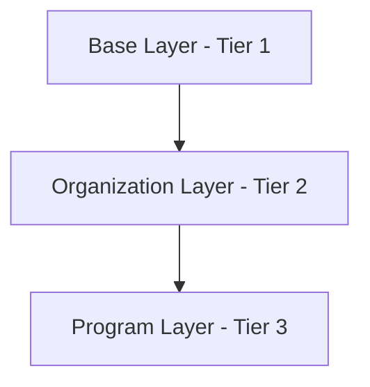
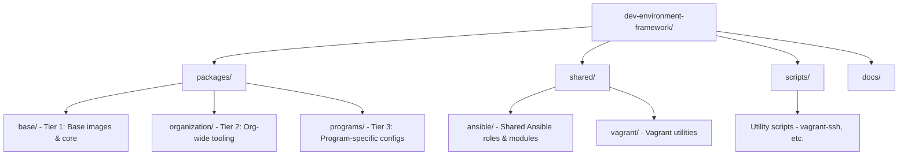

# DevX - Developer Environment Framework

A layered, extensible framework for building secure, customizable developer environments using Ansible and Vagrant. This monorepo structure supports progressive customization from base images through organization-level to program-specific configurations.

## Architecture Overview

The framework follows a three-tier abstraction model:



### Tier 1: Base Layer
- **Location**: `packages/base/`
- **Purpose**: Foundation images and core tooling
- **Contents**:
  - Hardened base OS images (Rocky Linux 8/9/10 via Bento boxes)
  - Security configurations for airgapped deployments
  - Base Vagrant box definitions with multi-provider support (VirtualBox, VMware, libvirt, Parallels)
  - Minimal system packages

> **Note**: We use [Bento boxes](https://app.vagrantup.com/bento) (`bento/rockylinux-*`) for comprehensive provider support, including Parallels for Apple Silicon Macs. See `packages/base/README.md` for details.

### Tier 2: Organization Layer
- **Location**: `packages/organization/`
- **Purpose**: Organization-wide developer tools and standards
- **Contents**:
  - Developer app store/catalog
  - Curated tool packages
  - Security-vetted dependencies
  - Internal FOSS ecosystem
  - Organization-specific box "spins" with overrides

### Tier 3: Program Layer
- **Location**: `packages/programs/`
- **Purpose**: Program/project-specific customizations
- **Contents**:
  - Program-specific configurations
  - Project toolchains
  - Custom overrides and extensions

## Key Features

- **Layered Inheritance**: Each tier inherits and extends the previous layer
- **High Configurability**: Every tool and setting is parameterized via Ansible variables
- **Security First**: Designed for airgapped, secure environments
- **Scalable**: Supports hundreds of concurrent users
- **Reproducible**: Version-controlled, declarative infrastructure

## Repository Structure



## Quick Start

### Prerequisites

#### System Requirements
- Vagrant >= 2.3.0
- Python >= 3.8

**Virtualization Provider:**
- **Intel Macs**: VirtualBox (default), VMware, or Parallels
- **Apple Silicon (ARM64)**: VirtualBox does not support ARM64. Use one of:
  - **Parallels Desktop** (recommended): `vagrant plugin install vagrant-parallels`
  - **libvirt/QEMU** (free): `brew install qemu libvirt && vagrant plugin install vagrant-libvirt`
  - **VMware Fusion**: `vagrant plugin install vagrant-vmware-desktop`

Our base images use Bento boxes which support all these providers out of the box.

#### Python Dependencies

This project uses a Python virtual environment for Ansible and related tools.

**Automatic Setup (Recommended):**

The Makefile automatically creates and configures the virtual environment when needed:

```bash
# Automatically sets up venv and runs linting
make lint

# Automatically sets up venv and runs validation
make validate

# Or manually set up the virtual environment
make setup-venv
```

**Manual Setup (Alternative):**

If you prefer to manage the virtual environment manually:

```bash
# Create and activate virtual environment
python3 -m venv .venv
source .venv/bin/activate  # macOS/Linux
# .venv\Scripts\activate   # Windows

# Install dependencies
pip install ansible ansible-lint
ansible-galaxy collection install -r requirements.yml
```

### Building with Makefile (Recommended)

The Makefile provides automatic provider detection, architecture validation, and dependency management:

```bash
# View available commands and detected system info
make help

# Build base Rocky 10 (default, recommended)
make build-base-rocky10

# Build organization spin (automatically builds base if needed)
make build-org-standard

# Build all compatible images for your architecture
make build-all

# Ensure Ansible inventory files exist
make setup-ansible-inventory
```

**Key Features:**
- 🔍 **Auto-detects** provider (Parallels on Apple Silicon, VirtualBox on Intel)
- ✅ **Validates** architecture compatibility (prevents Rocky 8 on ARM64)
- 🛠️ **Creates** missing Ansible inventory files automatically
- 📦 **Manages** dependencies (builds base image if needed)

**Override provider manually:**
```bash
make build-base-rocky10 VAGRANT_DEFAULT_PROVIDER=vmware_desktop
```

### Building Manually (Alternative)

```bash
# Rocky Linux 10 (default)
cd packages/base/images/rocky10
vagrant up

# On Apple Silicon, specify the provider:
vagrant up --provider=parallels
# or
vagrant up --provider=vmware_desktop

# Or Rocky Linux 9
cd packages/base/images/rocky9
vagrant up

# Rocky 8 is NOT compatible with Apple Silicon (ARM64)
```

### Creating an Organization Spin

```bash
# Using Makefile (recommended)
make build-org-standard

# Or manually
cd packages/organization/spins/standard
vagrant up
```

### Program-Specific Deployment

```bash
cd packages/programs/example-project
vagrant up
```

## Configuration

Configuration flows through three levels:

1. **Base defaults**: `packages/base/ansible/group_vars/all.yml`
2. **Organization overrides**: `packages/organization/ansible/group_vars/all.yml`
3. **Program overrides**: `packages/programs/<program>/ansible/group_vars/all.yml`

## Utility Scripts

The `scripts/` directory contains helpful utilities for working with Vagrant VMs:

### vagrant-ssh

Smart wrapper for `vagrant ssh` with auto-discovery and enhanced features:

```bash
# Interactive SSH to any VM by name
./scripts/vagrant-ssh base-rocky10

# Execute commands
./scripts/vagrant-ssh standard-devenv "docker ps"

# Start in specific directory
./scripts/vagrant-ssh standard-devenv --workdir /workspace
```

See [scripts/README.md](scripts/README.md) for detailed documentation.

## CI/CD Pipeline

Automated GitHub Actions workflow for building, testing, and publishing Vagrant boxes to GitHub Releases.

### Features

- ✅ **Automated Builds**: Triggered on changes to base images
- ✅ **Parallel Testing**: All Rocky Linux versions (8, 9, 10) built simultaneously  
- ✅ **GitHub Releases**: Published as release assets with SHA256 checksums
- ✅ **Zero Setup**: No external accounts or authentication required
- ✅ **Free Storage**: Unlimited for public repositories

### Quick Links

- **[Quick Start Guide](.github/QUICKSTART.md)** - 10-minute setup
- **[Pipeline Documentation](.github/workflows/README.md)** - Complete workflow details
- **[Latest Release](../../releases/latest)** - Download pre-built boxes
- **[GitHub Actions](../../actions)** - View build status

### Using Pre-built Boxes

```bash
# Download from GitHub Releases
wget https://github.com/dotbrains/devx/releases/latest/download/base-rocky10.box
vagrant box add dotbrains/devx-base-rocky10 base-rocky10.box

# Use in your project
vagrant init dotbrains/devx-base-rocky10
vagrant up
```

### Running the Pipeline

**Automatic**: Push changes to `packages/base/images/**` triggers builds

**Manual**: Actions → Build and Publish Vagrant Boxes → Run workflow

See the [Quick Start Guide](.github/QUICKSTART.md) for detailed setup instructions.

## Contributing

See [CONTRIBUTING.md](./CONTRIBUTING.md) for development guidelines.

## License

MIT License - See [LICENSE](./LICENSE)
