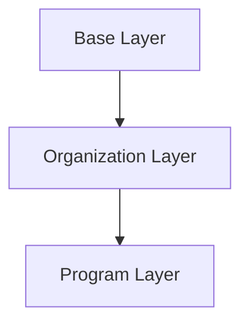

# DevX Documentation

This directory contains the MkDocs documentation for the DevX project.

## 🌐 Live Documentation

Once deployed, documentation is available at:
- **Production**: https://dotbrains.github.io/devx/

## 🚀 Quick Start

### Local Development

```bash
# Build documentation
make docs

# Serve locally at http://localhost:8000
make serve-docs
```

### Manual Setup (without Make)

```bash
# Navigate to docs directory
cd docs

# Install dependencies
pip install -r requirements.txt

# Build documentation
mkdocs build

# Serve locally
mkdocs serve
```

## 📦 Dependencies

All dependencies are listed in `requirements.txt`:
- `mkdocs` - Documentation generator
- `mkdocs-material` - Material theme
- `pymdown-extensions` - Markdown extensions

## 🔧 Configuration

Documentation is configured via `mkdocs.yml`:
- **Theme**: Material Design with dark/light mode
- **Features**: Navigation tabs, search, code copy, syntax highlighting
- **Extensions**: Admonitions, code blocks, tables, mermaid diagrams

## 📁 Structure

```
docs/
├── mkdocs.yml           # MkDocs configuration
├── requirements.txt     # Python dependencies
├── source/             # Documentation source files (Markdown)
│   ├── index.md
│   ├── getting-started.md
│   ├── architecture/
│   └── ...
└── site/               # Built documentation (gitignored)
```

## 🔄 Deployment

Documentation is automatically deployed to GitHub Pages via GitHub Actions.

### Automatic Deployment

The workflow (`.github/workflows/docs.yml`) automatically:
1. Builds documentation when changes are pushed to `docs/**`
2. Validates in strict mode (fails on warnings)
3. Deploys to GitHub Pages

### Manual Deployment

You can trigger deployment manually:
1. Go to: **Actions** → **Deploy Documentation**
2. Click **Run workflow**
3. Select branch and click **Run workflow**

### Initial Setup (One-Time)

To enable GitHub Pages for the first time:

1. **Go to Repository Settings**
   - Navigate to: `Settings` → `Pages`

2. **Configure Source**
   - Source: Select **GitHub Actions**
   - Save changes

3. **Trigger First Deployment**
   ```bash
   # Make a change to docs and push
   git add docs/
   git commit -m "docs: initial deployment"
   git push origin master
   ```

4. **Wait for Deployment**
   - Go to: **Actions** tab
   - Watch the "Deploy Documentation" workflow
   - Once complete, docs will be live at: https://dotbrains.github.io/devx/

## ✏️ Writing Documentation

### Adding New Pages

1. Create a new Markdown file in `source/`:
   ```bash
   touch source/new-page.md
   ```

2. Add content with proper frontmatter (optional):
   ```markdown
   # Page Title
   
   Your content here...
   ```

3. Update navigation in `mkdocs.yml`:
   ```yaml
   nav:
     - New Section:
         - New Page: new-page.md
   ```

### Using Features

#### Code Blocks

````markdown
```python
def hello_world():
    print("Hello, DevX!")
```
````

#### Admonitions

```markdown
!!! note "Optional Title"
    This is a note admonition.

!!! warning
    This is a warning.

!!! tip
    This is a tip.
```

#### Mermaid Diagrams

````markdown

````

#### Tabs

```markdown
=== "Tab 1"
    Content for tab 1

=== "Tab 2"
    Content for tab 2
```

## 🐛 Troubleshooting

### Build Fails Locally

1. **Check Python version**: Python 3.7+ required
   ```bash
   python3 --version
   ```

2. **Reinstall dependencies**:
   ```bash
   pip install -r requirements.txt --upgrade
   ```

3. **Clear cache**:
   ```bash
   rm -rf site/
   mkdocs build --clean
   ```

### Deployment Fails

1. **Check workflow logs**: Go to Actions tab and review errors
2. **Verify GitHub Pages is enabled**: Settings → Pages → Source: GitHub Actions
3. **Check permissions**: Workflow has correct permissions (already configured)

### Links Not Working

- Use relative paths for internal links: `[Link](../other-page.md)`
- Don't include `.md` extension in navigation config
- Use absolute URLs for external links

### Search Not Working

- Make sure `search` plugin is enabled in `mkdocs.yml` (already configured)
- Rebuild documentation: `mkdocs build --clean`

## 📊 Build Metrics

- **Typical local build time**: < 5 seconds
- **CI/CD build + deploy time**: 1-3 minutes
- **Page count**: Check `mkdocs.yml` nav section

## 🤝 Contributing

When contributing to documentation:

1. **Preview locally** before pushing
2. **Check for broken links**: `mkdocs build --strict`
3. **Follow Markdown style**: Consistent formatting
4. **Update navigation**: Add new pages to `mkdocs.yml`
5. **Test builds**: Ensure no warnings or errors

## 📚 Resources

- [MkDocs Documentation](https://www.mkdocs.org/)
- [Material for MkDocs](https://squidfunk.github.io/mkdocs-material/)
- [PyMdown Extensions](https://facelessuser.github.io/pymdown-extensions/)
- [GitHub Pages Documentation](https://docs.github.com/en/pages)

## 🆘 Support

For documentation-related issues:
1. Check this README
2. Review workflow documentation: `.github/workflows/README.md`
3. Open an issue in the repository
