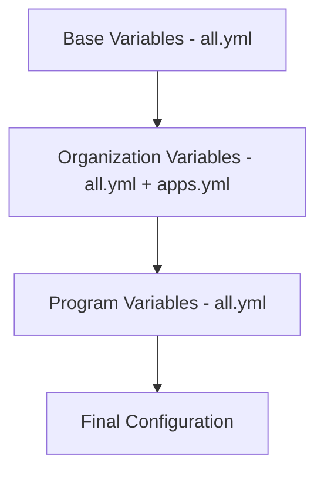
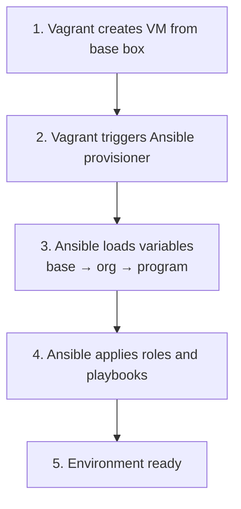
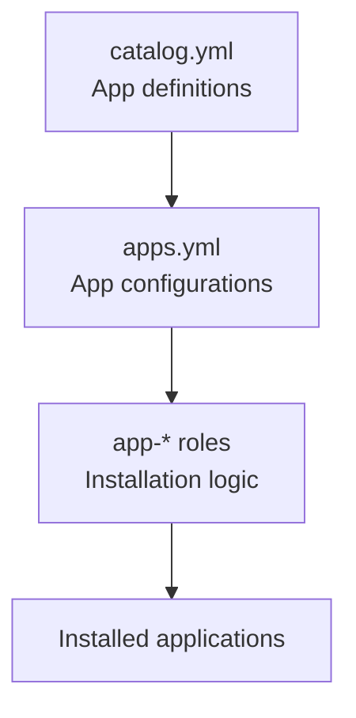
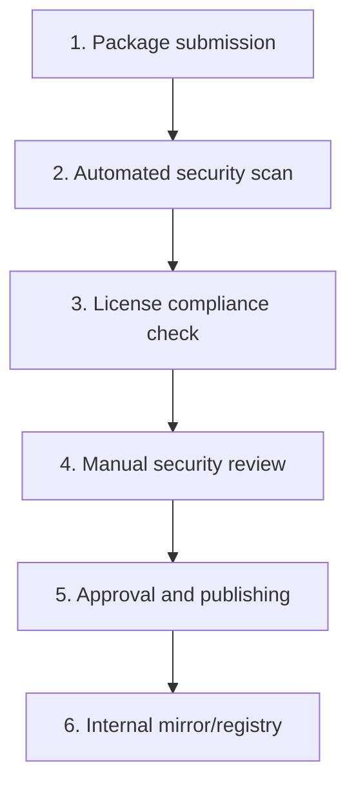

# Architecture

The Developer Environment Framework uses a three-tier layered architecture that enables progressive customization while maintaining security and consistency.

## Design Principles

1. **Layered Abstraction**: Each tier builds upon the previous, inheriting and extending capabilities
2. **Configuration Override**: Higher tiers can override lower tier settings
3. **Security by Default**: Security hardening applied at the base with no weakening at higher tiers
4. **Modularity**: Components can be independently developed and tested
5. **Reproducibility**: Declarative configuration ensures consistent environments

## Three-Tier Model

### Tier 1: Base Layer

**Purpose**: Provides hardened, minimal OS images suitable for secure deployments.

**Responsibilities**:

- OS hardening and security baseline
- CIS benchmark compliance
- SELinux/AppArmor configuration
- Minimal package set
- Airgap compatibility
- Foundation for all higher tiers

**Outputs**:

- Vagrant base boxes (.box files)
- Security configuration baselines
- Core system roles

**Key Files**:

- `packages/base/images/rocky10/Vagrantfile`
- `packages/base/ansible/playbooks/base-setup.yml`
- `packages/base/ansible/group_vars/all.yml`

### Tier 2: Organization Layer

**Purpose**: Provides organization-wide developer tools, standards, and curated packages.

**Responsibilities**:

- App Store management
- FOSS package curation
- Security vetting and compliance
- Organization-specific spins
- Shared development tools
- License management

**Outputs**:

- Organization spin boxes
- App Store catalog
- FOSS package registry
- Organization roles and playbooks

**Key Files**:

- `packages/organization/app-store/catalog.yml`
- `packages/organization/spins/*/Vagrantfile`
- `packages/organization/ansible/group_vars/apps.yml`

### Tier 3: Program Layer

**Purpose**: Provides project-specific customizations, toolchains, and configurations.

**Responsibilities**:

- Project-specific tool versions
- Custom application stacks
- CI/CD integration
- Team-specific workflows
- Environment configuration
- Program overrides

**Outputs**:

- Program-specific environments
- Project configurations
- Deployment scripts

**Key Files**:

- `packages/programs/*/Vagrantfile`
- `packages/programs/*/ansible/group_vars/all.yml`
- `packages/programs/*/ansible/playbooks/program-setup.yml`

## Configuration Flow

### Inheritance Model



### Override Precedence

When the same variable is defined at multiple tiers:

```yaml
# Base: packages/base/ansible/group_vars/all.yml
base_timezone: "UTC"
app_docker_enabled: true

# Organization: packages/organization/ansible/group_vars/all.yml
base_timezone: "America/New_York"  # Overrides base
app_docker_version: "24.0"         # Extends base

# Program: packages/programs/example/ansible/group_vars/all.yml
app_docker_version: "23.0.6"       # Overrides organization
program_name: "example"            # New variable
```

**Result**:

- `base_timezone`: "America/New_York" (organization override)
- `app_docker_enabled`: true (from base)
- `app_docker_version`: "23.0.6" (program override)
- `program_name`: "example" (program specific)

## Component Interactions

### Vagrant + Ansible Flow



### App Store Architecture



### FOSS Package Flow



## Security Architecture

### Defense in Depth

1. **Base Layer**: Hardened OS, minimal packages, SELinux
2. **Organization Layer**: Vetted packages, security scanning
3. **Program Layer**: Project-specific security policies

### Airgap Support

The framework supports fully airgapped deployments:

- Base images require no internet access
- FOSS packages can be mirrored internally
- All dependencies pre-packaged
- Local package repositories

### Secrets Management

- No hardcoded secrets
- Ansible Vault for sensitive data
- Environment variable injection
- Integration with external secret managers (Vault, etc.)

## Scalability Considerations

### Horizontal Scaling

- Multiple users can use the same base/org boxes
- Program environments are independent
- Parallel provisioning supported

### Performance Optimization

- Layered box approach reduces provisioning time
- Ansible role caching
- Package mirrors for faster downloads
- Incremental provisioning

### Resource Requirements

| Tier | Min RAM | Min CPU | Disk Space |
|------|---------|---------|------------|
| Base | 2 GB    | 2 cores | 20 GB      |
| Organization | 4 GB | 2 cores | 40 GB |
| Program | 8 GB | 4 cores | 60 GB |

## Extension Points

The framework is designed to be extended at multiple points:

1. **Custom Spins**: Create organization-specific variants
2. **Custom Apps**: Add new apps to the catalog
3. **Custom Roles**: Develop reusable Ansible roles
4. **Custom Scripts**: Add utility scripts at any layer
5. **Custom Plugins**: Develop Ansible plugins for specific needs
