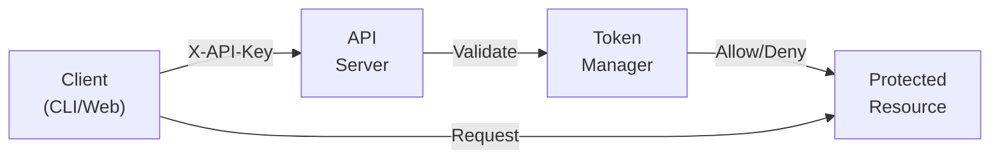

# Authentication

Complete guide to authentication in the FOSS Package Management System.

## Overview

The FOSS package system uses custom token-based authentication to secure write operations while keeping read operations public. This allows:

- **Public Access**: Anyone can search, list, and view packages
- **Secure Submissions**: Only authenticated users can submit packages
- **Flexible Deployment**: Easy to enable/disable for development vs production

## Quick Start

### 1. Generate Token

```bash
python3 -c "import secrets; print(secrets.token_urlsafe(32))"
```

Example output:
```
x7jK9mN2pQ4rT8vW1yZ3bD5fH6gJ8kL0nM2oP4qR6sT8uV0wX2yZ4aB6cD8eF0g
```

### 2. Configure API Server

Set the token(s) on the API server:

```bash
# Single token
export FOSS_API_TOKENS="x7jK9mN2pQ4rT8vW1yZ3bD5fH6gJ8kL0nM2oP4qR6sT8uV0wX2yZ4aB6cD8eF0g"

# Multiple tokens (comma-separated)
export FOSS_API_TOKENS="token1,token2,token3"
```

Start the API server:
```bash
cd packages/organization/foss-packages/api
./run.sh
```

### 3. Configure CLI

Set your token:

```bash
export FOSS_API_TOKEN="x7jK9mN2pQ4rT8vW1yZ3bD5fH6gJ8kL0nM2oP4qR6sT8uV0wX2yZ4aB6cD8eF0g"
```

## Architecture

### Token Flow



### Security Model

| Operation | Auth Required | Reason |
|-----------|--------------|---------|
| GET /packages | ❌ No | Public package discovery |
| GET /packages/{name} | ❌ No | View package details |
| GET /security/scans | ❌ No | Security transparency |
| GET /licenses | ❌ No | License information |
| POST /packages | ✅ Yes | Prevent spam/abuse |
| Approve/Reject | ✅ Yes | Administrative action |

## API Authentication

### Using cURL

```bash
# Set token
export FOSS_API_TOKEN="your-token"

# Submit package
curl -X POST http://localhost:8000/api/v1/packages \
  -H "Content-Type: application/json" \
  -H "X-API-Key: $FOSS_API_TOKEN" \
  -d '{
    "name": "requests",
    "version": "2.31.0",
    "type": "pypi",
    "description": "HTTP library"
  }'
```

### Using Python

```python
import requests
import os

API_TOKEN = os.getenv('FOSS_API_TOKEN')
BASE_URL = "http://localhost:8000/api/v1"

headers = {
    'Content-Type': 'application/json',
    'X-API-Key': API_TOKEN
}

# Submit package
response = requests.post(
    f"{BASE_URL}/packages",
    headers=headers,
    json={
        "name": "flask",
        "version": "3.0.0",
        "type": "pypi"
    }
)

print(response.json())
```

### Using JavaScript

```javascript
const API_TOKEN = process.env.FOSS_API_TOKEN;
const BASE_URL = 'http://localhost:8000/api/v1';

const headers = {
  'Content-Type': 'application/json',
  'X-API-Key': API_TOKEN
};

// Submit package
const response = await fetch(`${BASE_URL}/packages`, {
  method: 'POST',
  headers: headers,
  body: JSON.stringify({
    name: 'express',
    version: '4.18.0',
    type: 'npm'
  })
});

const result = await response.json();
console.log(result);
```

## CLI Authentication

### Setup

```bash
# Add to shell config (~/.bashrc, ~/.zshrc, ~/.config/fish/config.fish)
export FOSS_API_TOKEN="your-token"

# Or per-session
export FOSS_API_TOKEN="your-token"
```

### Usage

```bash
# Submit package (requires auth)
foss-cli submit axios 1.6.2 --type npm

# Alternative: use --token flag
foss-cli --token "your-token" submit axios 1.6.2 --type npm

# Public operations (no auth needed)
foss-cli search axios
foss-cli list
foss-cli info axios
```

## Token Management

### Multiple Tokens

Configure multiple tokens for different services/users:

```bash
export FOSS_API_TOKENS="frontend-token,backend-token,admin-token"
```

Benefits:

- Separate tokens per service
- Independent rotation
- Individual revocation
- Usage tracking

### Token Rotation

Rotate tokens regularly (recommended: every 90 days):

```bash
# 1. Generate new token
NEW_TOKEN=$(python3 -c "import secrets; print(secrets.token_urlsafe(32))")

# 2. Add to server (keep old token for transition)
export FOSS_API_TOKENS="$NEW_TOKEN,$OLD_TOKEN"

# 3. Update clients with new token
export FOSS_API_TOKEN="$NEW_TOKEN"

# 4. After grace period, remove old token
export FOSS_API_TOKENS="$NEW_TOKEN"
```

### Token Storage

**Development:**
```bash
# Environment variable (recommended)
export FOSS_API_TOKEN="your-token"

# .env file (with .gitignore)
echo 'FOSS_API_TOKEN="your-token"' >> .env
```

**Production:**
```bash
# Secrets manager (AWS, Azure, GCP)
aws secretsmanager get-secret-value --secret-id foss-api-token

# Kubernetes secret
kubectl create secret generic foss-api-token \
  --from-literal=token=your-token

# Docker secret
echo "your-token" | docker secret create foss-api-token -
```

## Error Handling

### 401 Unauthorized

**Error:**
```json
{
  "detail": "Missing API key. Provide X-API-Key header."
}
```

**Solution:**
```bash
# Verify token is set
echo $FOSS_API_TOKEN

# If empty, set it
export FOSS_API_TOKEN="your-token"
```

### 403 Forbidden

**Error:**
```json
{
  "detail": "Invalid API key"
}
```

**Solution:**
```bash
# Verify token matches server
echo $FOSS_API_TOKEN

# Contact administrator for valid token
# Check server configuration
```

## Development vs Production

### Development Mode

No authentication required (default):

```bash
# Don't set FOSS_API_TOKENS
./run.sh
```

- All endpoints accessible
- Useful for local testing
- Not recommended for shared environments

### Production Mode

Authentication enabled:

```bash
# Set one or more tokens
export FOSS_API_TOKENS="prod-token-1,prod-token-2"
./run.sh
```

- Write operations require auth
- Read operations remain public
- Recommended for all deployments

## Security Best Practices

### 1. Token Generation

✅ **DO:**

- Use `secrets.token_urlsafe(32)` or longer
- Generate cryptographically secure tokens
- Use minimum 32 characters

❌ **DON'T:**

- Use predictable tokens
- Use short tokens (< 32 chars)
- Reuse tokens across environments

### 2. Token Storage

✅ **DO:**

- Store in environment variables
- Use secrets managers in production
- Add `.env` to `.gitignore`

❌ **DON'T:**

- Commit tokens to version control
- Share tokens in chat/email
- Store tokens in code

### 3. Token Rotation

✅ **DO:**

- Rotate every 90 days minimum
- Have rotation procedure documented
- Support multiple tokens during transition

❌ **DON'T:**

- Use same token forever
- Rotate without grace period
- Forget to update all clients

### 4. Access Control

✅ **DO:**

- Use different tokens per service
- Use different tokens per environment
- Monitor token usage

❌ **DON'T:**

- Share single token across all services
- Use production tokens in development
- Ignore suspicious activity

### 5. Network Security

✅ **DO:**

- Use HTTPS in production
- Deploy behind reverse proxy with SSL
- Enable rate limiting

❌ **DON'T:**

- Send tokens over HTTP
- Expose API directly to internet
- Skip rate limiting

## Monitoring

### Request Logging

The API logs all requests with auth status:

```
GET /api/v1/packages - Auth: no - Status: 200 - Duration: 0.123s
POST /api/v1/packages - Auth: yes - Status: 201 - Duration: 0.456s
POST /api/v1/packages - Auth: no - Status: 401 - Duration: 0.012s
```

### Check Auth Status

Query the API root to see if auth is enabled:

```bash
curl http://localhost:8000/
```

Response:
```json
{
  "name": "FOSS Package API",
  "version": "1.0.0",
  "authentication": "enabled"
}
```

## Troubleshooting

### Token not working

1. Verify token is set:
   ```bash
   echo $FOSS_API_TOKEN
   ```

2. Check server logs:
   ```bash
   # Look for authentication errors
   grep "Auth:" logs/api.log
   ```

3. Test with curl:
   ```bash
   curl -H "X-API-Key: $FOSS_API_TOKEN" \
     http://localhost:8000/api/v1/packages
   ```

### Different token in each terminal

**Cause**: Token not persisted in shell config

**Solution**: Add to shell config file
```bash
echo 'export FOSS_API_TOKEN="your-token"' >> ~/.bashrc
source ~/.bashrc
```

### Server not enforcing auth

**Cause**: `FOSS_API_TOKENS` not set

**Solution**: Set on server and restart
```bash
export FOSS_API_TOKENS="your-token"
./run.sh
```

## See Also

- [REST API Reference](api/rest-api.md) - API documentation
- [CLI Tool Reference](api/cli-tool.md) - CLI documentation
