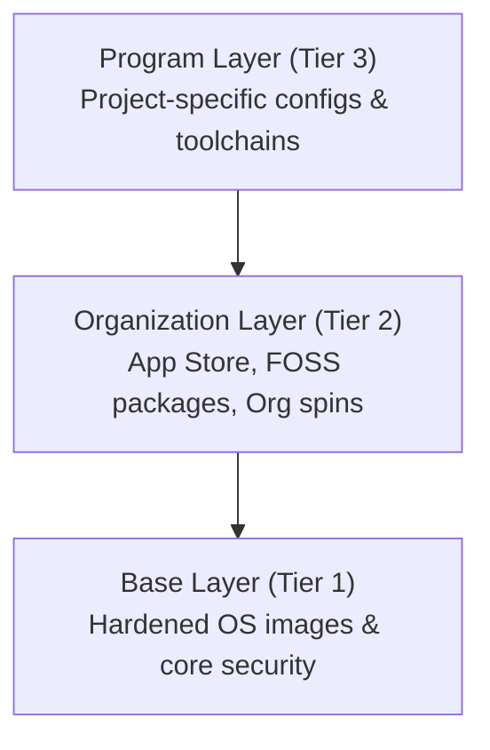

# DevX - Developer Environment Framework

A modular, layered framework for building secure, reproducible developer environments at scale.

## Overview

The Developer Environment Framework provides a three-tier architecture for managing developer environments, from hardened base OS images to project-specific configurations. Built with Vagrant and Ansible, it enables organizations to maintain consistent, secure, and highly customizable development environments.

## Key Features

- **Layered Architecture**: Three-tier model (Base → Organization → Program) for progressive customization
- **App Store**: Curated catalog of developer tools with version control and security vetting
- **FOSS Management**: Complete ecosystem for managing vetted open-source packages
- **Security First**: Hardened OS images with CIS compliance and airgap support
- **REST API**: Modern API for package management and automation
- **CLI Tools**: Command-line interface for easy package discovery and management

## Architecture Overview



## Quick Start

### Prerequisites

- [Vagrant](https://www.vagrantup.com/) (>= 2.3.0)
- [VirtualBox](https://www.virtualbox.org/) or other provider
- [Ansible](https://www.ansible.com/) (>= 2.14)

### Basic Usage

```bash
# Clone the repository
git clone https://github.com/dotbrains/devx.git
cd devx

# Build base image
make build-base

# Build organization spin
make build-org-standard

# Run tests
make test
```

## Use Cases

### For Organizations

- Maintain consistent developer environments across teams
- Enforce security policies and compliance requirements
- Manage approved tooling and packages centrally
- Support airgapped or restricted network environments

### For Teams

- Quickly spin up project-specific environments
- Inherit organization standards while customizing for project needs
- Version control environment configurations alongside code
- Onboard new team members faster

### For Individuals

- Reproducible development environments
- Experiment with different tool versions safely
- Keep development isolated from host system

## Core Components

### Base Layer

Provides hardened Rocky 9 images with:

- CIS security benchmarks
- SELinux enforcement
- Minimal package set
- Airgap compatibility

[Learn more about the Base Layer →](architecture/base-layer.md)

### Organization Layer

Includes:

- **App Store**: 17+ curated developer tools (Docker, Kubernetes, Python, Node.js, etc.)
- **FOSS Packages**: Vetted open-source packages with security scanning
- **Organization Spins**: Pre-configured environments for common use cases

[Learn more about the Organization Layer →](architecture/org-layer.md)

### Program Layer

Enables:

- Project-specific tool versions
- Custom application stacks
- Team workflows and configurations
- CI/CD integration

[Learn more about the Program Layer →](architecture/program-layer.md)

## FOSS Package Ecosystem

Complete package management system with:

- **REST API**: Programmatic access to package registry
- **CLI Tool**: Easy package discovery and submission
- **Security Scanning**: Automated vulnerability detection
- **License Management**: Compliance tracking and approval workflows

[Explore FOSS Packages →](foss-packages.md)

## Getting Help

- **[Getting Started Guide](getting-started.md)**: Step-by-step installation and setup
- **[Common Tasks](common-tasks.md)**: Frequently performed operations
- **[Utility Scripts](utility-scripts.md)**: Helper scripts for streamlined workflows
- **[Troubleshooting](troubleshooting.md)**: Solutions to common issues
- **[API Reference](api-reference.md)**: Complete API documentation

## Contributing

We welcome contributions! See our [Contributing Guide](contributing.md) for details.

## License

This project is licensed under the MIT License - see the LICENSE file for details.
