# FOSS Package Ecosystem

Internal Free and Open Source Software (FOSS) package ecosystem with security vetting, license compliance, and vulnerability monitoring.

## Overview

The FOSS ecosystem provides:
- **Security-Vetted Packages**: All packages undergo automated and manual security review
- **License Compliance**: Automated license scanning and approval workflows
- **Vulnerability Monitoring**: Continuous CVE scanning and alerts
- **Version Control**: Pinned versions with controlled updates
- **Internal Mirrors**: Airgap-ready package mirrors

## Architecture

```mermaid
graph TD
    Root[foss-packages/]
    
    Root --> Registry[registry/ - Package registry and metadata]
    Root --> Security[security/ - Security scanning results]
    Root --> Mirrors[mirrors/ - Internal package mirrors]
    Root --> Licenses[licenses/ - License compliance]
    Root --> Scripts[scripts/ - Management scripts]
    
    Registry --> RegPkg[packages.yml - Package definitions]
    Registry --> RegApp[approved/ - Approved package list]
    Registry --> RegPend[pending/ - Pending approval]
    
    Security --> SecScans[scans/ - Scan reports]
    Security --> SecVuln[vulnerabilities/ - CVE tracking]
    Security --> SecPol[policies/ - Security policies]
    
    Mirrors --> MirPypi[pypi/ - Python packages]
    Mirrors --> MirNpm[npm/ - Node packages]
    Mirrors --> MirMaven[maven/ - Java packages]
    Mirrors --> MirGen[generic/ - Generic binaries]
    
    Licenses --> LicAppr[approved-licenses.yml]
    Licenses --> LicRep[reports/]
    Licenses --> LicExc[exceptions/]
    
    Scripts --> ScAdd[add-package.sh]
    Scripts --> ScSec[security-scan.sh]
    Scripts --> ScAppr[approve-package.sh]
    Scripts --> ScSync[sync-mirrors.sh]
```



## Workflows

### Adding a New Package

```bash
cd packages/organization/foss-packages

# Submit package for review
./scripts/add-package.sh <package-name> <version>

# This triggers:
# 1. Automated security scan
# 2. License compliance check
# 3. Vulnerability assessment
# 4. Creates approval ticket
```

### Security Scanning

```bash
# Scan a specific package
./scripts/security-scan.sh <package-name>

# Scan all packages
./scripts/security-scan.sh --all

# Generate security report
./scripts/generate-security-report.sh
```

### Package Approval Process

1. **Submission**: Developer submits package via `add-package.sh`
2. **Automated Checks**:
   - Security scanning (Trivy, Grype, Snyk)
   - License validation
   - CVE database check
   - Dependency analysis
3. **Manual Review**: Security team reviews scan results
4. **Approval/Rejection**: Package moved to approved or rejected
5. **Mirror Sync**: Approved packages synced to internal mirrors

### Using FOSS Packages

#### In Ansible Playbooks

```yaml
- name: Install vetted packages
  ansible.builtin.include_role:
    name: foss-package-installer
  vars:
    foss_packages:
      - name: requests
        type: pypi
        version: "2.31.0"
      - name: express
        type: npm
        version: "4.18.2"
```

#### Configuration

```yaml
# packages/organization/ansible/group_vars/all.yml
org_foss_enabled: true
org_foss_repository_url: "https://foss-mirror.internal"
org_foss_security_scanning: true
org_foss_auto_updates: false
org_foss_update_policy: "manual"  # or "automatic", "security-only"
```

## Package Registry

### Package Definition Format

```yaml
# registry/packages.yml
packages:
  - name: "requests"
    type: "pypi"
    version: "2.31.0"
    license: "Apache-2.0"
    status: "approved"
    security_scan_date: "2024-01-15"
    vulnerabilities: []
    approved_by: "security-team"
    approved_date: "2024-01-16"
    description: "HTTP library for Python"
    upstream_url: "https://pypi.org/project/requests/"
    dependencies:
      - urllib3
      - certifi
      - charset-normalizer
```

## Security Policies

### Security Levels

- **Critical**: Must be patched within 24 hours
- **High**: Must be patched within 7 days
- **Medium**: Must be patched within 30 days
- **Low**: Patched in next regular update cycle

### Approved Licenses

Default approved licenses (configurable):
- MIT
- Apache-2.0
- BSD-2-Clause, BSD-3-Clause
- ISC
- PostgreSQL
- Python-2.0

### Scanning Tools

- **Trivy**: Container and filesystem vulnerability scanner
- **Grype**: Vulnerability scanner for software artifacts
- **Snyk**: Dependency vulnerability scanner
- **SPDX**: License scanning and SBOM generation
- **CycloneDX**: Software Bill of Materials (SBOM)

## Mirror Management

### Setting Up Mirrors

```bash
# Initialize mirrors
./scripts/init-mirrors.sh

# Sync specific mirror
./scripts/sync-mirrors.sh --type pypi

# Sync all mirrors
./scripts/sync-mirrors.sh --all
```

### Mirror Configuration

```yaml
# mirrors/config.yml
mirrors:
  pypi:
    enabled: true
    upstream: "https://pypi.org/simple"
    sync_schedule: "0 2 * * *"  # Daily at 2 AM
    storage_path: "/opt/foss-mirrors/pypi"
    
  npm:
    enabled: true
    upstream: "https://registry.npmjs.org"
    sync_schedule: "0 3 * * *"
    storage_path: "/opt/foss-mirrors/npm"
    
  maven:
    enabled: true
    upstream: "https://repo1.maven.org/maven2"
    sync_schedule: "0 4 * * *"
    storage_path: "/opt/foss-mirrors/maven"
```

## Monitoring & Reporting

### Vulnerability Monitoring

```bash
# Check for new CVEs
./scripts/check-vulnerabilities.sh

# Generate vulnerability report
./scripts/generate-vulnerability-report.sh --format html
```

### Compliance Reporting

```bash
# Generate license compliance report
./scripts/generate-license-report.sh

# Export SBOM
./scripts/export-sbom.sh --format cyclonedx
```

## API Integration

### REST API Endpoints

```
GET  /api/v1/packages              # List all packages
GET  /api/v1/packages/:name        # Get package details
POST /api/v1/packages              # Submit new package
GET  /api/v1/security/scans/:name  # Get security scan results
GET  /api/v1/licenses/:name        # Get license information
```

### CLI Tool

```bash
# Install FOSS CLI
./scripts/install-foss-cli.sh

# Use CLI
foss-cli search <package-name>
foss-cli info <package-name>
foss-cli security <package-name>
foss-cli submit <package-name> <version>
```

## Best Practices

1. **Always Use Vetted Packages**: Never install unvetted packages in production
2. **Pin Versions**: Use specific versions, not "latest"
3. **Regular Updates**: Review and approve security updates promptly
4. **Monitor CVEs**: Subscribe to vulnerability notifications
5. **Audit Regularly**: Conduct periodic security audits
6. **Document Exceptions**: All license exceptions must be documented and approved

## Airgap Deployment

For fully airgapped environments:

1. **Export Package Bundle**:
   ```bash
   ./scripts/export-bundle.sh --output /path/to/bundle.tar.gz
   ```

2. **Transfer to Airgapped Environment**

3. **Import Bundle**:
   ```bash
   ./scripts/import-bundle.sh --input /path/to/bundle.tar.gz
   ```

4. **Configure Local Mirror**:
   ```yaml
   org_foss_repository_url: "file:///opt/foss-mirrors"
   base_airgapped_mode: true
   ```
