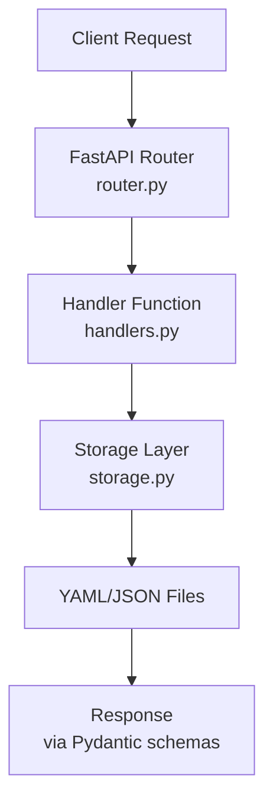

# API Architecture

The FOSS Package API is organized using a modular router-based architecture for maintainability and scalability.

## Directory Structure

```
api/
├── __init__.py              # Package initialization
├── app.py                   # Main FastAPI application
├── config.py                # Application configuration
├── schemas.py               # Pydantic models (shared)
├── storage.py               # Data access layer (shared)
├── requirements.txt         # Python dependencies
├── Dockerfile               # Container image
├── docker-compose.yml       # Docker Compose configuration
├── run.sh                   # Development startup script
├── README.md                # User documentation
├── ARCHITECTURE.md          # This file
│
└── routes/                  # Modular API routes
    ├── __init__.py          # Routes module initialization
    │
    ├── packages/            # Package management endpoints
    │   ├── __init__.py      # Module exports
    │   ├── router.py        # FastAPI router with endpoints
    │   └── handlers.py      # Business logic handlers
    │
    ├── security/            # Security scan endpoints
    │   ├── __init__.py      # Module exports
    │   ├── router.py        # FastAPI router with endpoints
    │   └── handlers.py      # Business logic handlers
    │
    └── licenses/            # License information endpoints
        ├── __init__.py      # Module exports
        ├── router.py        # FastAPI router with endpoints
        └── handlers.py      # Business logic handlers
```

## Design Patterns

### 1. **Router-Handler Pattern**

Each API domain is separated into:
- **Router** (`router.py`): Defines endpoints, request/response models, and validation
- **Handler** (`handlers.py`): Contains business logic, separated from HTTP concerns

**Benefits:**
- Clear separation of concerns
- Easy to test handlers independently
- HTTP layer decoupled from business logic

**Example:**
```python
# router.py - HTTP layer
@router.get("/packages")
def list_packages(q: Optional[str] = None):
    return handle_list_packages(q=q)

# handlers.py - Business logic
def handle_list_packages(q: Optional[str] = None) -> List[PackageOut]:
    pkgs = storage_list_packages()
    # ... filtering logic
    return filtered_packages
```

### 2. **Shared Components**

Common functionality is centralized:
- **schemas.py**: Pydantic models used across all routes
- **storage.py**: Data access functions
- **config.py**: Application settings

### 3. **Dependency Injection**

FastAPI's dependency injection is used for:
- Background tasks
- Request validation
- Shared resources

## Module Responsibilities

### `app.py` - Application Core
- FastAPI app initialization
- Middleware configuration (CORS)
- Router registration
- Root endpoints (health, docs)

### `routes/packages/`
**Endpoints:**
- `GET /api/v1/packages` - List/search packages
- `GET /api/v1/packages/{name}` - Get specific package
- `POST /api/v1/packages` - Submit new package

**Responsibilities:**
- Package querying with filters
- Package submission
- Background scan triggering

### `routes/security/`
**Endpoints:**
- `GET /api/v1/security/scans/{name}` - List security scans

**Responsibilities:**
- Scan result retrieval
- Vulnerability reporting
- Security score aggregation

### `routes/licenses/`
**Endpoints:**
- `GET /api/v1/licenses/{name}` - Get license info

**Responsibilities:**
- License information lookup
- Compatibility checking
- Risk assessment data

## Data Flow



## Adding a New Endpoint

1. **Create new route module** (if needed):
```bash
mkdir -p api/routes/newfeature
touch api/routes/newfeature/{__init__.py,router.py,handlers.py}
```

2. **Define router** (`router.py`):
```python
from fastapi import APIRouter
from .handlers import handle_new_feature

router = APIRouter()

@router.get("/newfeature")
def get_new_feature():
    return handle_new_feature()
```

3. **Implement handler** (`handlers.py`):
```python
def handle_new_feature():
    # Business logic here
    return {"result": "data"}
```

4. **Register router** (`app.py`):
```python
from .routes import newfeature

app.include_router(newfeature.router, prefix="/api/v1", tags=["NewFeature"])
```

## Testing Strategy

### Unit Tests
Test handlers independently:
```python
def test_handle_list_packages():
    result = handle_list_packages(q="flask")
    assert len(result) > 0
```

### Integration Tests
Test routers with FastAPI TestClient:
```python
from fastapi.testclient import TestClient

def test_list_packages_endpoint():
    response = client.get("/api/v1/packages?q=flask")
    assert response.status_code == 200
```

## Error Handling

Errors are handled at the router level:
- **HTTPException**: Used for client errors (4xx)
- **ValueError**: Caught from handlers and converted to 400
- **Unhandled exceptions**: Caught by FastAPI and returned as 500

## Performance Considerations

1. **Lazy Loading**: Routes are only loaded when needed
2. **Background Tasks**: Long-running operations (scans) run asynchronously
3. **Response Models**: Pydantic validation ensures type safety with minimal overhead

## Security Considerations

1. **Input Validation**: Automatic via Pydantic
2. **CORS**: Configured in app.py, restrict in production
3. **Authentication**: Can be added as middleware or dependencies
4. **Rate Limiting**: Can be added per-router or globally

## Future Enhancements

Potential additions to the modular structure:

- `routes/admin/` - Administrative endpoints
- `routes/reports/` - Report generation
- `routes/webhooks/` - Webhook management
- `routes/users/` - User authentication/management
- `middleware/` - Custom middleware components
- `dependencies/` - Reusable FastAPI dependencies
- `services/` - External service integrations

## Maintenance Guidelines

1. **Keep routers thin**: Business logic goes in handlers
2. **Share common logic**: Use storage.py for data access
3. **Document endpoints**: Use docstrings and OpenAPI descriptions
4. **Type hints**: Always use type hints for better IDE support
5. **Error handling**: Handle errors at the appropriate level
6. **Testing**: Write tests for both handlers and routers
